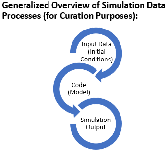

# Data Curation Network Lesson Plan: Curating Simulation-based Research 

| Lesson Components | Lesson Description |
| ------------- | ------------- |
| Data Type | Simulation Data, Simulation Models, Simulation Workflows |
| Primary fields or areas of use  | <li>Oceanography and Atmospheric Sciences and Meteorology</li><li>Earth Sciences</li><li>Chemical Engineering</li><li>Astrophysics and Astronomy</li><li>Aerospace Engineering</li><li>Civil and Environmental Engineering</li><li>Physics</li><li>Chemistry</li><li>Climate</li> |
| Common file formats  | <li>netCDF</li><li>HDF, HDF5</li><li>MAT</li><li>.m</li><li>.dat</li><li>RData</li><li>Tabular (.csv & .xls)</li><li>Text</li><li>Other binary formats</li> |
| Summary  | The curriculum covers a range of foundational background information about what simulation data is and the pieces that make up simulation datasets. The workshop looks at two simulation datasets throughout and a third dataset when focusing on the Transform step. The curriculum teaches learners to formulate high impact considerations that uncover traditional barriers to FAIR when curating simulation data. This curriculum leans to a high level overview of the workshop, the curriculum requires the slides for more detail.    This curriculum assumes some prior knowledge of CURATE(D) and exposure curating scientific data. The size of the two datasets are 403 MB and 2 GB and require the data to be downloaded onto a device such as Windows, OSX, or Linux. |
| Estimated time  | 2.5 hours |
| Related primers  | See published <a href="https://datacurationnetwork.org/outputs/data-curation-primers/">primers</a>    <li><a href="https://github.com/DataCurationNetwork/data-primers/blob/master/Accessibility%20Data%20Curation%20Primer/accessibility-data-curation-primer.md">Accessibility Data Primer</a></li> <li><a href="https://github.com/DataCurationNetwork/data-primers/blob/master/PDF%20Data%20Curation%20Primer/PDF-data-curation-primer.md">Acrobat PDF Primer</a></li> <li><a href="https://github.com/DataCurationNetwork/data-primers/blob/master/Column%20Binary%20Data%20Curation%20Primer/column-binary-data-curation-primer.md">Column Binary Data Curation Primer</a></li> <li><a href="https://github.com/DataCurationNetwork/data-primers/blob/master/Jupyter%20Notebook%20Data%20Curation%20Primer/Jupyter%20Notebooks%20Data%20Curation%20Primer.md">Jupyter Notebooks Primer</a></li> <li><a href="https://deepblue.lib.umich.edu/handle/2027.42/154686">Matlab Primer</a></li> <li><a href="https://github.com/DataCurationNetwork/data-primers/blob/master/MSAcess%20Data%20Curation%20Primer/MSAccessCopy2.md">Microsoft Access Primer</a></li> <li><a href="https://github.com/DataCurationNetwork/data-primers/blob/master/Excel%20Data%20Curation%20Primer/Excel%20Data%20Curation%20Primer.md">Microsoft Excel Primer</a></li> <li><a href="https://deepblue.lib.umich.edu/handle/2027.42/145724">netCDF Primer</a></li> <li><a href="https://github.com/DataCurationNetwork/data-primers/blob/master/R%20Data%20Curation%20Primer/R-data-curation-primer.md">R Primer</a></li> |
| Link to Slides  | Slide Deck: <a href="https://docs.google.com/presentation/d/1QUE-AdhvZZFzDQhe3SGfrPBtmL-dex6mb06wMVYwBkg/edit?usp=sharing">Curating simulation-based research</a> |
| Date Created | July 2023 |
| Created By | L. Wynholds, UCLA, https://orcid.org/0000-0002-9066-9773 Heather Shimon, University of Wisconsin-Madison, https://orcid.org/0000-0002-4395-0132 Fernando Rios, University of Arizona, https://orcid.org/0000-0001-6262-3260  Girmaye Misgna, University of Pennsylvania  Wanda Marsolek, University of Minnesota, https://orcid.org/0000-0002-1771-3969 |

# Objectives and Vocabulary

Learning Objectives:
1. Participants will gain a basic understanding of simulation data
and simulation-based research for curation purposes
	- key characteristics/unique elements of simulation data
	- intro to simulation data models
	- examples of uses for simulation data
	- pointing to other DCN primers
	- overview of jargon/glossary

2. Participants will understand how to develop discussions with
researchers regarding their simulation data. Through guided interactions
with each other, participants will develop dataset specific approaches
to establishing key questions necessary for interacting with researchers
and curating simulation data.
	- key questions from CURATED perspective (e.g. how to document)
	- common challenges related to simulation data
	- helpful materials for CURATED activities (e.g. NCAR rubric)
	- what to preserve
	- ethical considerations
	- accessibility considerations
	- equity considerations
3. Participants will work with example datasets to gain a better
understanding of common tools, methods and practices used to produce and
curate simulation data
	- methods
	- data models
	- file formats
	- licensing, data use agreements

Glossary: <a href="https://github.com/DataCurationNetwork/curation-curriculum/blob/b3ceb41b653b5bef5a1a3569bc005550b571b1a6/Specialized%20Data%20Types/Simulations/Simulations_glossary.pdf">Terms to Know</a></td>

# Dataset(s) for Lesson 

Required Tools/Software:
- text editor
- PDF viewer
- spreadsheet program
- browser-based viewer for looking at simulation data formats, depends on dataset

## Dataset Citations:
Dataset A:

Yang, Huang; Waugh, Darryn W., 2020, "Data associated with Yang et
al., 2020, Dependence of Atmospheric Transport into the Arctic on Extent
of the Hadley Cell", <a href="https://doi.org/10.7281/T1/AWJUGZ">https://doi.org/10.7281/T1/AWJUGZ</a>, Johns Hopkins Research Data Repository, V1

Dataset B:

Do, H. X., Smith, J. P., Fry, L. M., Gronewold, A. D. (2020). Monthly
water balance estimates for the Laurentian Great Lakes from 1950 to 2019
(v1.1) [Data set], University of Michigan - Deep Blue Data. <a
href="https://doi.org/10.7302/tx97-nn12">https://doi.org/10.7302/tx97-nn12</a>

Dataset C:

Horna Munoz, Daniel; Constantinescu, George; Rhoads, Bruce ; Lewis,
Quinn; Sukhodolov, Alexander (2020): Confluence Density Effects
Simulation Database. University of Illinois at Urbana-Champaign. <a
href="https://doi.org/10.13012/B2IDB-6257171_V1">https://doi.org/10.13012/B2IDB-6257171_V1</a></td>

# Outline/Overview of Simulation Data

<figure>  <fig caption>Figure 1: High-level overview of simulation data process for curation purposed.</figcaption> </figure>   

- Simulations/models tend to follow a linear workflow process, e.g.
a set of initial data, a body of code processing the data and a
resulting output
	- input data → code → output data

- All three elements need to be adequately described for curation
purposes
	- the data archive might include only portions of the above three elements
- Simulation models share many similarities to AI models. The
former tend to be driven by mathematical models while the latter
resemble a black box where the model is not known exactly and is driven
by the input data (via training)

# Lesson Outline and Content
## Introduction 
Mode(s): Lecture
Estimated time: 20-25minutes

## Lesson intro
- Introduce goals/objectives
- Scope
	- focus on conceptual aspects of curation
	- no focus on specific file formats. Refer to other primers.
	- no AI/ML
- Activity 1 (background questions)

What is special about curating simulation models and data?
- Key points of <a href="https://www.frontiersin.org/articles/10.3389/fclim.2021.763420/full">Open Science Expectations for Simulation-Based Research by Mullendore, Mayernik, and Shuster (2021)</a>
- Key characteristics/unique elements of simulation data
- Simulation vs AI/ML
- Mention that CURATED is more for explanatory reasons, in reality,
things happen non-linearly, steps might happen simultaneously

Simulation data and the CURATED curation model
- Nothing special about the data themselves
- Lean heavily on other primers for tools and guides
- Especially code/software curation

Exercise: "What I Know," "What I Want to Know," <del>and "What I
Learned</del>. (KWL) KW mentimeter

## Document & Evaluate
Mode(s): Lecture, download curation log template 
Estimated time: 5-10 minutes

Lecture:
Introduce Document and Evaluate steps, steps are iterative and
curation is not linear.  
Download the Curation Log template and use it throughout the rest of
the workshop for the document step.  
Evaluation will be done throughout the curation process, in each step
rather than an end step, but also at the end. Constantly thinking about
the datasets’ FAIRness, can it be made more FAIR, and how.

## Check step
Mode(s):Lecture, independent exercise
Estimated time: 30 minutes

Lecture:

CURATE(D) CHECK step revolves around inventorying and reviewing the
contents of the dataset and verifying that it is appropriate for the
repository. This often includes:
- Review to ensure data is in scope for the repository
- Inventory the contents of the data files (e.g., open and sample
the files or code)
- Verify all metadata provided by the researcher; check available
documentation

Simulation data tends to be the result of interactions between
models, datasets and code. The check step needs to document how the data
was produced, including documenting the details of the code and data
used to produce the dataset.
When checking simulation data pay special attention to checking
for:
- code used to produce the dataset
	- is the code used to produce the dataset included in the dataset
packages?
	- is the code archived elsewhere?
	- is the code part of another project?
	- is the version of the code documented?
	- is adequate documentation of code runs included in the metadata?
e.g. version of coding language, details of computers used to run code,
date of code runs, etc.
- documentation of related materials
	- is the production of the model, code, programming languages,
initial data, data processing, metadata, etc already documented
elsewhere?
- documentation of data production
	- was there initial or calibration data used? Is it documented?
included in the dataset? published elsewhere?
	- what formats or metadata standards were used?
	- is the initial data derived from other datasets? if so, is it
already documented elsewhere?
- references to data formats/metadata standards/code
used/programming languages used
	- are the references to formats, metadata standards, code, etc
documented in such as manner as to be readily accessible for indexing
and/or machine readable?
- related publications
	- are the references to related publications documented adequately
to be readily accessible for indexing?
	- are any of the related publications required to understand the data? if so, is that adequately represented in the metadata/documentation?

In addition to the standard Check steps
- How to determine whether a dataset might be simulation data/code?
	- data clues
	- software clues
	- keywords to look for
- Look for ethics issues around the code, initial data, model, etc, especially around human subjects data, sensitive species information, or other issues that may be politically contentious but not necessarily sensitive (e.g. climate modeling)
	- ethics of access to publications (e.g. publication being behind a paywall)
- Sample data and parameters
	- Are these included or available elsewhere (other repositories,
paper)
- Relevant primers to refer to
	- Code
	- netCDF

- Short exercise - 10 min
	- Given a dataset, determine whether it is simulation data or
not
	- Do the necessary files appear to be there?
	- Sample dataset: <a href="https://doi.org/10.7281/T1/AWJUGZ">https://doi.org/10.7281/T1/AWJUGZ</a>

## Understand Step
Mode(s): Lecture
Estimated time: 25 minutes

Lecture (25 minutes)
CURATE(D) Understand Step

The Understand step is the deeper dive into the data/code and how it
makes sense together.
- After inventorying and reviewing the contents, the Understand
step is a closer examination of:
	- what they are<
	- how they interrelate
	- what information is needed for reuse
- Check and Understand steps generate the information needed for
the Request step.

Understand step often includes
From the general CURATED model, we are going beyond checking, we are
trying to understand how the files fit together, if someone with similar
disciplinary knowledge would be able to make sense of the collection,
and pulling from the Evaluate step to make sure that files open and meet
ethical requirements for sharing.
- Examining for quality assurance and usability
issues
- Assessing for ethical issues including sensitive
data, consent, risk to persons/places, licensing/permissions,
accessibility, etc. (see “Checking for Ethical Concerns” slide)
- Determining if the documentation is sufficient
for peer researchers to understand and reuse the contents
- Understanding how the files relate to each
other

Understand step: Simulations specifically
For simulation data, we are considering a sequential workflow with
consistent naming conventions. This means looking for missing files in a
sequence and checking that file names follow the naming convention in
order to understand how they relate to each other.
Focus on how the files relate to each other
- Simulation data can consist of sequential files - check for
missing files in a sequence
- Often, experiments are repeated and datasets will contain
multiple similar folders and files
	- Check that naming conventions are consistent
	- Also keep in mind that a standard duplicate file check will
usually reveal multiple identical files ‒ for simulation data, this is
often ok, since only small things may change between runs, and there can
be repeated files due to multiple runs of the model
- Helpful tools
	- Directory exploration
		- <a href="https://windirstat.net/index.html">WinDirStat</a> (Windows Directory Statistics), <a href="https://diskanalyzer.com/">WizTree</a> (Windows) </blockquote></li>
		- <a href="https://wiki.gnome.org/Apps/DiskUsageAnalyzer">Disk Usage Analyzer/baobab</a> (Linux, Mac, Windows/WSL)
	- Duplicate checkers
		- <a href="https://apps.microsoft.com/detail/9P8TBNHH1MS9?hl=en-us&gl=US">Duplicate File Finder</a> (Windows)
		- <a href="https://github.com/adrianlopezroche/fdupes">fdupes</a> (Linux)
- Make sure it’s clear which outputs correspond to which
inputs
- Reference the publication if it is available. This can help you
understand the model and how the files work together.

Understand: DCN primers for data formats
The example that we looked at had familiar data formats, but
simulation data can be in many formats. Use the data curation primers
when working with formats that you are unfamiliar with.

- Simulation data can be in many formats
- <a href="https://datacurationnetwork.org/outputs/data-curation-primers/">Data
curation primers</a> useful when working with simulation data
	- <a
href="https://github.com/DataCurationNetwork/data-primers/blob/master/Accessibility%20Data%20Curation%20Primer/accessibility-data-curation-primer.md">Accessibility
Data Primer</a>
	- <a
href="https://github.com/DataCurationNetwork/data-primers/blob/master/PDF%20Data%20Curation%20Primer/PDF-data-curation-primer.md">Acrobat
PDF Primer</a>
	- <a
href="https://github.com/DataCurationNetwork/data-primers/blob/master/Column%20Binary%20Data%20Curation%20Primer/column-binary-data-curation-primer.md">Column
Binary Data Curation Primer</a>
	- <a
href="https://github.com/DataCurationNetwork/data-primers/blob/master/Jupyter%20Notebook%20Data%20Curation%20Primer/Jupyter%20Notebooks%20Data%20Curation%20Primer.md">Jupyter
Notebooks Primer</a>
	- <a
href="https://deepblue.lib.umich.edu/handle/2027.42/154686">Matlab
Primer</a>
	- <a
href="https://github.com/DataCurationNetwork/data-primers/blob/master/MSAcess%20Data%20Curation%20Primer/MSAccessCopy2.md">Microsoft
Access Primer</a>
	- <a
href="https://github.com/DataCurationNetwork/data-primers/blob/master/Excel%20Data%20Curation%20Primer/Excel%20Data%20Curation%20Primer.md">Microsoft
Excel Primer</a>
	- <a
href="https://deepblue.lib.umich.edu/handle/2027.42/145724">netCDF
Primer</a>
	- <a
href="https://github.com/DataCurationNetwork/data-primers/blob/master/R%20Data%20Curation%20Primer/R-data-curation-primer.md">R
Primer</a>

Which parts are needed? (Review from introduction
slides)

Simulation data can consist of many files -- and it might not be
useful or possible to keep everything. That is why it is so important to
remember that simulation data are tools for knowledge production, not
data production; and that “knowledge production research should preserve
minimal output in repositories.” (See “Characteristics of simulation
data” introduction slide)

What we DO need to preserve are the inputs (initial conditions),
code/model, and outputs - depending on the project, could be available
through another provider. (See “Common elements of simulation models”
introduction slide)

And provide documentation of how it all works together.

One of the important parts of the Understand step is figuring out
which parts of the dataset and model need to be curated to support
reproducibility and knowledge production purposes. In some cases, the
curator and researcher may need to archive the input and code, but not
keep the output. In other cases, the code may be archived elsewhere and
the input described in detail in a publication. Each dataset is likely
to vary in which elements are critical, which is why the Understand step
is so important for simulation datasets.
Knowledge production vs data production

- “... primary goal of most projects involving computer simulations
is to increase scientific knowledge and the simulations are used as a
tool to that end.”
- “... we are producing far more simulation output than can be
reasonably stored in repositories. Knowledge production research should
preserve minimal output in repositories.” Mullendore et al.
(2021)

Components to preserve and share (this varies)
- input data: initial conditions, calibration files, parameter
values
- code/model: preprocessing, configuration, post
processing
- outputs: depends on the simulation
- documentation

What do these things look like?
Let’s look at Example Dataset B to see what common elements of
simulation models can look like.

Example Dataset B

Do, H. X., Smith, J. P., Fry, L. M., Gronewold, A. D. (2020). Monthly
water balance estimates for the Laurentian Great Lakes from 1950 to 2019
(v1.1) [Data set], University of Michigan - Deep Blue Data. <a
href="https://doi.org/10.7302/tx97-nn12">https://doi.org/10.7302/tx97-nn12</a>
From the files list, we can see that they include the inputs,
model/source code, and outputs.

[Show unzipped files]

- Documentation, inputs, model/source code, and outputs
- The README gives context with an overview, software
specification, variable definitions, and more
	- “This data set contains new estimates of the Great Lakes water
balance together with the L2SWBM source code and inputs synthesized for
this project…”
- Input files are Excel csv files
- The source code/model R files are organized in run order and
include a config_README
- Output files are pdfs and Excel csv

## Request Step

Mode(s): Lecture, small group activity
Estimated time: 20 minutes

Lecture (5 minutes)

CURATE(D) Request Step
The Request step is your opportunity to discuss the dataset with the
researcher. Pull the questions that have arisen from the Check and
Understand steps. This can include questions about the dataset
components to share, inconsistencies in the data, unclear run sequence,
missing files, bad naming conventions, sensitive data, etc.). Record
your questions for the researcher in your curator log.
- Data appraisal conversations with researchers
	- Conversations about the dataset
	- Pull from the Check and Understand steps
	- Arrive at a shared understanding of the curation process with the
researcher (good for future conversations!)
- Record all questions/concerns (ethics, missing files, excessive
output files, bad naming conventions, etc.) in your Curator Log
📝

EarthCube rubric
If you are unsure about what output data to preserve, a tool for
conversations with researchers is the EarthCube rubric. Review it to
develop an understanding of the researcher perspective, identify
questions for researchers, and see examples of use cases for how much
data to preserve
- <a
href="https://zoidy.shinyapps.io/ModelDataRubric/">EarthCube
rubric</a> tool to:
	- Understand researcher perspective
	- Identify questions for researchers 📝
	- Determine the <a
href="https://modeldatarcn.github.io/rubrics-worksheets/Rubric-Instructions-and-Use-Cases.pdf">Use
Case</a> for output data to preserve
		- Use Case 1: “Preserve Few Simulation Workflow Outputs”
		- Use Case 2: “Preserve Selected Simulation Workflow
Outputs"
		- Use Case 3: “Preserve the Majority of Simulation Workflow
Outputs”

Role playing activity (15 minutes)
- In groups of 4-6 people:
	- Open the <a
href="https://deepblue.lib.umich.edu/data/concern/file_sets/d504rk54x">README
file</a> from Example Dataset B and review it. Pay particular
attention to the “Research Overview” and the list of files under “Files
Contained Here.”
	- In your group, decide who will act as the researcher depositing
the output data, and who will act as the data curator receiving the data
files.
- Researchers work together and data curators work together. Open
the <a href="https://zoidy.shinyapps.io/ModelDataRubric/">EarthCube
rubric</a> and answer the questions as best you can with the <a
href="https://deepblue.lib.umich.edu/data/concern/data_sets/sb3978457#items_display">Example
Dataset B</a> in mind. Answer the questions as you would in your
role as the researcher or data curator.
	- You can use the file list in the README file, and/or download the
files to explore them further.
- Note which questions are easier or more difficult for you to
answer in the role that you are in.
	- Discuss what questions you would ask the other role (researcher
or data curator).
- After completing the rubric, researchers and data curators
discuss together:
	- Did you arrive at the same Use Case?
	- What questions were easy or difficult to answer?
	- What questions do you have for each other?- If time, discuss as a large group and see if the small groups had
similar experiences

## Augment Step
Mode(s): Lecture and large group discussion
Estimated time: 10 minutes

Metadata
- Discipline standards
	- resources
- Improve findability, accessibility, and documentation
	- Cautionary tale (things that get changed/edited may need to be
changed throughout the dataset package)

Ethical Considerations
- bibliographic information reflects correct author
attribution
- licenses<

## Transform Step 
Mode(s): Lecture, independent exercise
Estimated time: 30 minutes

When dealing with simulation data, it is often necessary to
transform the data into file formats and standards that ensure
sharing, long-term access, preservation, and
interoperability across different tools and systems.

Discussion and Important considerations:
- Understand, Check, and Augment steps lay the foundation for
actions to take in the Transform step.
- Look for opportunities to transform in all the common elements of
simulation data (input, code, output, and documentation). However, the
most common and less risky transformation is in the output data and
documentation. There is a high risk of making mistakes, breaking the
workflow, or data corruption in attempting to transform the input and
code. For code/software suggestions can be made for open source
alternatives.
- Simulation data formats can often be specific to particular
software or model structures varying across several disciplines,
complicating standardization efforts and contributing to the lack of a
clear archival standard. This makes selection of preservations formats
for simulation data challenging.
- Transforming files to open formats can simplify access and
preserve data, but could also introduce subtle errors or loss of data
during transformation between file formats.
- Considerations for transformation include complexity, effort
required, and actual improvement in accessibility.
- All being equal, the preference should be for open file formats
when presented with a choice between proprietary and open file formats.
Otherwise, following the recommended file format statement of the
Library of Congress for Geospatial data, "preserving the most complete
data, even if proprietary, with a preference for native formats" also
works in the case of simulation data.
- It is important to involve the researcher in the transformation
process to ensure data integrity and consider the best transformation
approach.
- In most cases, It is advisable to let the researcher, who is the
most familiar with the data, perform the transformation themselves. This
helps reduce the risk of inadvertently altering important aspects of the
data.
- Prioritize elements crucial for data submission and reuse when
deciding on transformation.
- Also refer to other primers such as the geospatial data primer
and simulation code primer for specific recommendations to transforming
data.

Some commonly used simulation platforms/software:
- OpenFOAM: <a
href="https://openfoam.org/">https://openfoam.org/</a>
- GNU Octave: <a
href="https://octave.org/">https://octave.org/</a>
- MATLAB: <a
href="https://www.mathworks.com/products/matlab.html">https://www.mathworks.com/products/matlab.html</a>

Some common simulation data visualization & transformation
tools:
- Paraview: <a
href="https://www.paraview.org/">https://www.paraview.org/</a>
- VisIt: <a
href="https://visit-dav.github.io/visit-website/about/">https://visit-dav.github.io/visit-website/about/</a>
-  Some simulation software and frameworks (such as MATLAB) provide
built-in tools or plugins for converting simulation data into
standardized formats offering export capabilities to formats like CSV,
XML, or Excel, allowing users to transform simulation data into widely
compatible formats.
- Custom Scripting and Programming: Using programming languages
like Python, R, or MATLAB, you can write scripts to read simulation data
in one format, perform necessary transformations, and output it in a
different format or standard. This approach offers flexibility and
control over the transformation process.
- Data Wrangling and Data Integration Platforms: Data wrangling
tools like OpenRefine provide features for data cleaning,
transformation, and integration. These platforms offer functionalities
to convert simulation data into standardized formats, resolve
inconsistencies, and ensure compatibility with various systems and
tools.
- Employing help from AI methods (eg. ChatGPT code interpreter,
co-pilot) to write scripts for custom transformation in a specific
language such as python or R.

Exercise & example dataset: Demonstrate data
inspection, tool search, and transformation process to make them more
interoperable, reusable, preservation friendly, and non-proprietary.
- Climate engineering NetCDF files produced with the climate model
CESM1(WACCM)
https://www.cesm.ucar.edu/working_groups/Whole-Atmosphere/.
	- <a
href="https://cornell.app.box.com/s/h18flj5i5oerjlkixcckns7vsz1v1o6m">https://cornell.app.box.com/s/h18flj5i5oerjlkixcckns7vsz1v1o6m</a>
	- Transform older NetCDF format to HDF5 or NetCDF4
	- Alternative data example: <a
href="https://databank.illinois.edu/datasets/IDB-0791318">https://databank.illinois.edu/datasets/IDB-0791318</a>

- Confluence Density Effects Simulation Database: <a
href="https://databank.illinois.edu/datasets/IDB-6257171">https://databank.illinois.edu/datasets/IDB-6257171</a>
	- Transform the two xls files to csv and the docx documentation
file to .pdf format.
	- What is the .lay file? Can it be transformed into an open file
format? suggest alternative open format and conversion tools to the
proprietary tecplot, <a
href="https://www.tecplot.com/products/tecplot-360/">https://www.tecplot.com/products/tecplot-360/</a>
	- Alternatives to Tecplot (CFD [computational fluid dynamics] 3d
simulation & visualization software): Paraview (free and
open-source), OpenFOAM (free and open-source), VisIt (free and
open-source)
	- Evaluate: "Check that any transformations didn’t introduce
problems"

## Wrap up

Mode(s): independent exercise/Group
exercise
Estimated time: 10 minutes</td>

Exercise: "What I Learned. (KWL) and “What is still muddy” L M
mentimeter

# Bibliography & Resources
Ordered as referenced throughout lesson plan and slide deck
Interactive presentation software. Mentimeter. <a
href="https://www.mentimeter.com/">https://www.mentimeter.com/</a>
Mullendore, G. L., Mayernik, M. S., & Schuster, D. C. (2021).
Open science expectations for simulation-based research. Frontiers in
Climate, 3, 763420. <a
href="https://doi.org/10.3389/fclim.2021.763420">https://doi.org/10.3389/fclim.2021.763420</a>
What About Model Data? Best Practices for Preservation and
Replicability. <a
href="https://zoidy.shinyapps.io/ModelDataRubric/">https://zoidy.shinyapps.io/ModelDataRubric/#</a>
<a
href="https://github.com/DataCurationNetwork/curation-curriculum/blob/b3ceb41b653b5bef5a1a3569bc005550b571b1a6/Specialized%20Data%20Types/Simulations/Exercise%20Materials/Simulations_CuratorLog_Template.txt">CuratorLog.txt</a>
<a
href="https://github.com/DataCurationNetwork/curation-curriculum/blob/b3ceb41b653b5bef5a1a3569bc005550b571b1a6/Specialized%20Data%20Types/Simulations/Exercise%20Materials/Simulations_CuratorLog_Template.txt">CuratorLog.google</a>
(make a copy for yourself)
<a
href="https://github.com/DataCurationNetwork/curation-curriculum/blob/b3ceb41b653b5bef5a1a3569bc005550b571b1a6/Specialized%20Data%20Types/Simulations/Exercise%20Materials/Simulations_CuratorLog_Example_20230929.pdf">Sample
completed/redacted Curator Log</a>
<a
href="https://drive.google.com/file/d/1UEa_fIfWRPgKYf2wstQy9siF3gc4VxX1/view?usp=drive_link">Worksheet
for evaluating data quality</a>
Fair principles. GO FAIR. (2022, January 21). <a
href="https://www.go-fair.org/fair-principles/">https://www.go-fair.org/fair-principles/</a>
Global Indigenous Data Alliance. (n.d.). The CARE Principles for
Indigenous Data Governance. <a
href="https://www.gida-global.org/care">https://www.gida-global.org/care</a>
Microsoft . (2023, February 16). Fate: Fairness, accountability,
transparency & ethics in Ai. Microsoft Research.
https://www.microsoft.com/en-us/research/theme/fate/overview/
Gebru, T., Morgenstern, J., Vecchione, B., Vaughan, J. W., Wallach,
H., Daumé III, H., & Crawford, K. (2021, December 1). Datasheets for
datasets. arXiv.org. https://arxiv.org/abs/1803.09010
Yang, H., Waugh, D. W., Orbe, C., & Chen, G. (2020).
Dependence of Atmospheric Transport Into the Arctic on the Meridional
Extent of the Hadley Cell. Geophysical Research Letters, 47(20). <a
href="https://doi.org/10.1029/2020gl090133">doi:
10.1029/2020gl090133</a>
Do, H. X., Smith, J. P., Fry, L. M., & Gronewold, A. D. (2020).
Seventy-year long record of monthly water balance estimates for Earth’s
largest lake system. Scientific Data, 7(1), 276. <a
href="https://doi.org/10.1038/s41597-020-00613-z">https://doi.org/10.1038/s41597-020-00613-z</a>
Gronewold, A. D., Smith, J. P., Read, L., & Crooks, J. L. (2020).
Reconciling the water balance of large lake systems. Advances in Water
Resources, 103505. <a
href="https://doi.org/10.1016/j.advwatres.2020.103505">https://doi.org/10.1016/j.advwatres.2020.103505</a>
Metadata standards catalog. Metadata Standards Catalog. <a
href="https://rdamsc.bath.ac.uk/">https://rdamsc.bath.ac.uk/</a>
Tecplot. Tecplot 360. https://tecplot.com/products/tecplot-360/
kitware. Open-source, multi-platform data analysis and visualization
application. ParaView. <a
href="https://www.paraview.org/">https://www.paraview.org/</a>
OpenFOAM. <a
href="https://www.openfoam.com/">https://www.openfoam.com/</a>
University of Virginia Library. Data types & file formats | UVA
Library. <a
href="https://library.virginia.edu/data/data-management/plan/format-types">https://library.virginia.edu/data/data-management/plan/format-types</a>
Library of Congress. Recommended Formats Statement – table of
contents | Resources (Preservation, Library of Congress). <a
href="https://www.loc.gov/preservation/resources/rfs/TOC.html">https://www.loc.gov/preservation/resources/rfs/TOC.html</a>
Cornell University Library. Ecommons: Cornell’s Digital
Repository: Recommended File Formats. <a
href="https://guides.library.cornell.edu/ecommons/formats">https://guides.library.cornell.edu/ecommons/formats</a></td>
